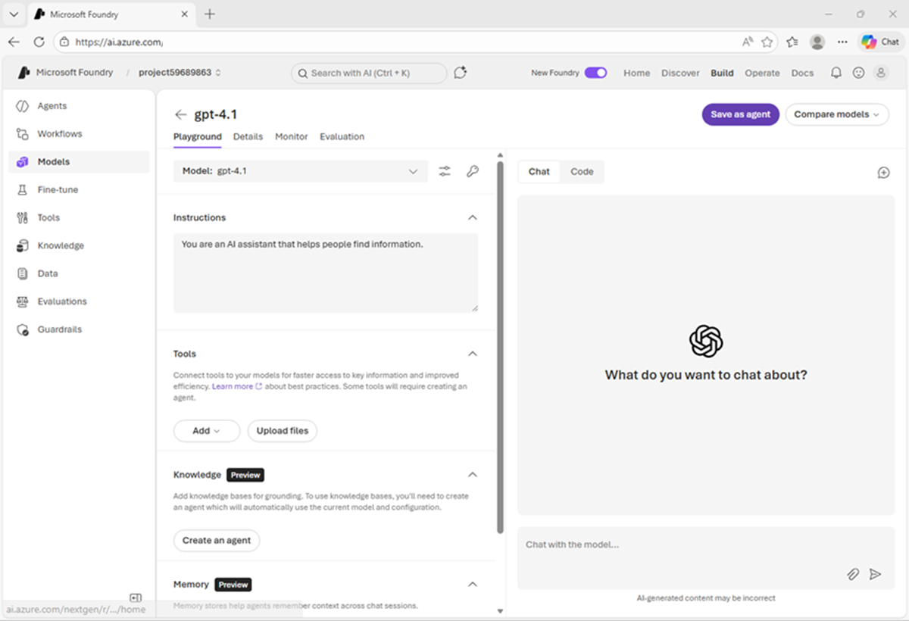
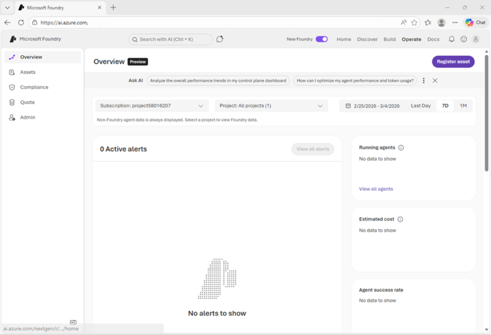
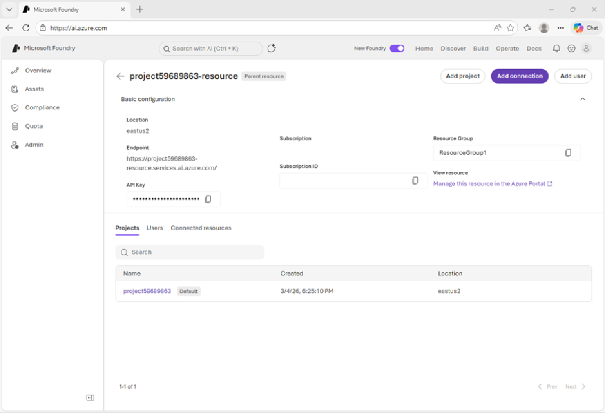
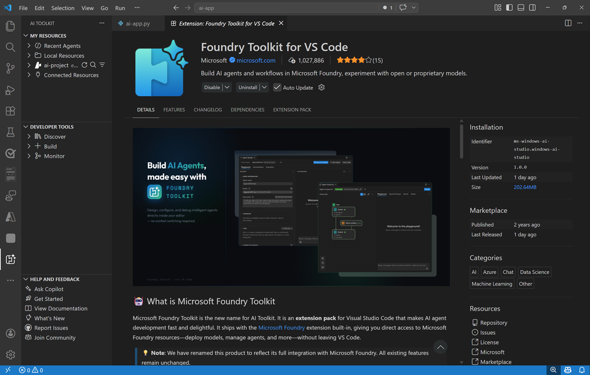
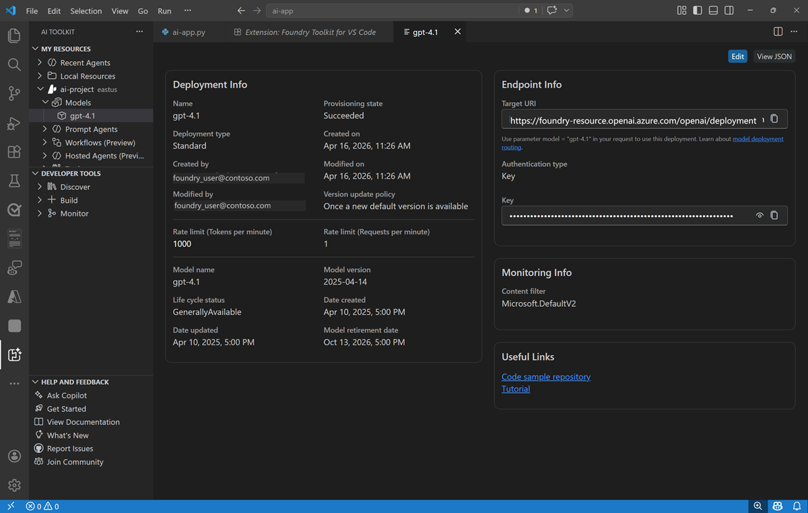
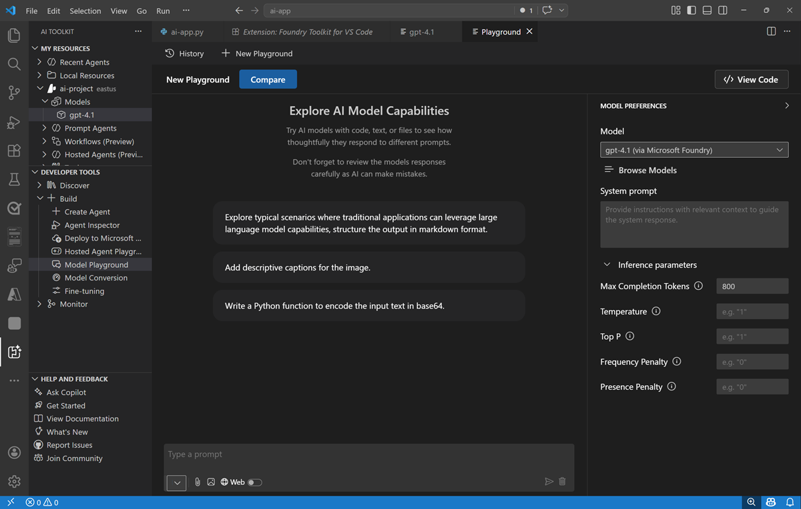

---
lab:
  title: AI 開発プロジェクトの準備
  description: Microsoft Foundry プロジェクトで AI リソースを整理し、Visual Studio Code 用の Foundry Toolkit 拡張機能の使用を開始する方法を学びます。
  level: 200
  duration: 30
  islab: true
  primarytopics:
    - Microsoft Foundry
    - Visual Studio Code
---

# AI 開発プロジェクトの準備

この演習では、Microsoft Foundry ポータルを使用してプロジェクトを作成し、AI ソリューションを構築するための準備を行います。

この演習は約 **30** 分かかります。

> **注**: この演習で使用されるテクノロジの一部は、プレビューの段階または開発中の段階です。 予期しない動作、警告、またはエラーが発生する場合があります。

## 前提条件

この演習を開始するには、以下のものが必要です。

- 有効な [Azure サブスクリプション](https://azure.microsoft.com/pricing/purchase-options/azure-account)
- [Visual Studio Code](https://code.visualstudio.com/) がインストールされていること
- [Python バージョン**3.13.xx**](https://www.python.org/downloads/release/python-31312/) がインストール済み\*
- [Git](https://git-scm.com/install/) がインストールおよび構成済み
- [Azure CLI](https://learn.microsoft.com/cli/azure/install-azure-cli?view=azure-cli-latest) がインストールされていること

> \* Python 3.14 を使用できますが、一部の依存関係がそのリリース用にまだコンパイルされていません。 このラボでは Python 3.13.12 でテストが正常に終了しました。

## Microsoft Foundry プロジェクトを作成する

Microsoft Foundry では "プロジェクト" を使って、AI ソリューションの開発に使われるモデル、リソース、データ、その他の資産を整理します。

1. Web ブラウザーで、[Microsoft Foundry ポータル](https://ai.azure.com) (`https://ai.azure.com`) を開き、Azure 資格情報を使用してサインインします。 初めてサインインすると開くヒントやクイック スタートのペインをすべて閉じ、必要な場合は、左上にある Foundry のロゴを使ってホーム ページに移動します。

1. まだ有効になっていない場合は、ページ上部のツール バーで **[新しい Foundry]** オプションを有効にします。 次に、新しいプロジェクトを一意の名前で作成し、このときに **[高度なオプション]** 領域を展開して、プロジェクトの設定を次のとおりに指定します。
    - **Foundry リソース**: *リソースの既定の名前を使用します (通常は {project_name}-resource)*
    - **[サブスクリプション]**:"*ご自身の Azure サブスクリプション*"
    - **リソース グループ**: *リソース グループを作成または選択します*
    - **リージョン**: **[こちらの一覧](https://learn.microsoft.com/azure/foundry/openai/how-to/responses#region-availability)**{:target="_blank"}にある、**AI Foundry の推奨**リージョンのいずれかを選択します

    > **ヒント**: 選択したリージョンは書き留めておいてください。 この情報は後で必要になります。

1. **［作成］** を選択します プロジェクトが作成されるまで待ちます。

    準備ができると、プロジェクトのホーム ページが開きます。

    

## モデルのデプロイとテスト

どの生成 AI プロジェクトの中核にも、少なくとも 1 つの生成 AI モデルがあります。

1. これで**ビルドを開始する**準備は完了です。 **[モデルの検索]** を選択して (または **[検出]** ページで **[モデル]** タブを選択して) Microsoft Foundry モデル カタログを表示します。

1. `gpt-4.1` モデルを検索し、検索結果から選択してそのモデル カードを表示します。

    モデル カードは、モデルの機能と制限事項を理解し、要件に適しているかどうかを判断するのに役立つモデルに関する情報を提供します。

    

1. 既定の設定で **[デプロイ]** を選択して、モデルのデプロイを作成します。

    モデル デプロイにより、プロジェクト内のモデルを操作できます。

    モデルがデプロイされると、モデル プレイグラウンドが自動的に開き、モデルをテストできます。

    

1. **[指示]** ボックスに、次の指示を入力します。

    ```text
    You are an AI assistant that can provide information and advice about AI software development.
    ```

1. チャット ウィンドウで、以下のように「`Describe three key considerations for working with Large Language Models for AI application development.`」などのクエリを入力し、応答を確認します。

    モデルが、検討が必要な重要な考慮事項を提供していれば良いのですが。

## Foundry Azure のリソースとプロジェクト エンドポイントを表示する

1. Foundry ポータルの上部のメニュー バーで、**[運用]** を選択します。

    オペレーション センターでは、プロジェクトの監視、アラートの表示、エージェントのパフォーマンスとクォータの監視、リソースの管理を行うことができます。

    

1. 左側のナビゲーション ウィンドウで、**[管理者]** ボタンを選択し、詳細を表示します。

    - *resource* レベルは、プロジェクトをサポートするために Azure で作成された **[Foundry]** リソースに関連します。 このリソースは、Foundry のサービスとモデルへの接続を含んでおり、AI 開発プロジェクトへのユーザー アクセスを一元的に管理するための場所となります。
    - *プロジェクト* レベルは個々のプロジェクトに関連します。プロジェクトでプロジェクト固有のリソースを追加および管理できます。 1 つのリソースで複数のプロジェクトをサポートできます (最初に作成されるのは、リソースの *default* プロジェクトです)。

    ![Foundry ポータルの [管理者] ページのスクリーンショット。](../media/ai-foundry-admin.png)

1. プロジェクトに関連付けられている**親リソース**へのリンクを選択します。

    リソース構成の詳細が表示されるはずです。

    

    Foundry リソースには "エンドポイント" があり、ここを通じてクライアント アプリケーションが resource レベルの機能 (resource 内のすべてのプロジェクトで共有される Foundry Tools など) にアクセスできます。**

1. メニュー バーで **[ホーム]** を選択して、プロジェクトのホーム ページに戻ります。
1. キー、プロジェクト エンドポイント、および Azure OpenAI エンドポイントは書き留めておいてください。

    この情報は、クライアント アプリケーションからプロジェクトレベルのリソースに接続するために使用されます。

    - "キー" は、モデルとツールに対するキーベースの認証に使用されます (ただし、ほとんどの運用環境のシナリオでは、認証済みのユーザーとアプリケーションの ID に基づく Microsoft Entra ID 認証の使用を検討する必要があります)。**
    - "プロジェクト エンドポイント" は、OpenAI の**Responses** API を使用して Foundry で直接提供されるモデル (OpenAI モデルを含む) にアクセスしたり、Foundry 固有の API (Foundry Agent サービスなど) にアクセスしたりするために使用されます。**
    - "OpenAI エンドポイント" は、**Chat Completions** API、**Responses** API など、OpenAI の API を使用してモデルにアクセスするために使用されます。**

## Visual Studio Code 用の Foundry Toolkit 拡張機能をインストールする

開発者は、Foundry ポータルである程度の時間作業しますが、Visual Studio Code でも多くの時間を費やす可能性があります。 Foundry Toolkit 拡張機能は、開発環境を離れることなく Foundry プロジェクト リソースを操作するための便利な方法を提供します。

1. Visual Studio Code を起動する
1. 左側のナビゲーション バーで、**[拡張機能]** ページを表示します。
1. 拡張機能のマーケットプレースで `Foundry Toolkit` を検索し、**[Foundry Toolkit for VS Code]** 拡張機能をインストールします。

    拡張機能のインストールには 1 分ほどかかる場合があります。

1. 拡張機能をインストールした後、左側のナビゲーション バーで **[AI ツールキット]** ページを選び、読み込まれるまで待ちます。

    

1. [Foundry Toolkit] ペインで、**[Microsoft Foundry リソース]** を展開し、Azure に接続し (ご自分の資格情報でサインインする)、前に作成した Foundry プロジェクトを選択して、既定のプロジェクトを設定します。

1. 既定のプロジェクトを設定した後、プロジェクトを展開し、**[モデル]** を展開して、前にデプロイした **[gpt-4.1]** モデルを選択します。

    モデル デプロイの詳細については、こちらをご覧ください。

    

1. [Foundry Toolkit] ペインの **[開発者ツール]** セクションで、**[ビルド]** を展開し、**[モデル プレイグラウンド]** を選択します。 次に、**[gpt-4.1]** モデルを選択します (まだ選択されていない場合)。

    モデルをテストできる対話型のプレイグラウンドが Visual Studio Code で開きます。

    

## まとめ

この演習では、Microsoft Foundry を作成し、Foundry ポータルで詳しく調べました。 また、Visual Studio Code の Foundry Toolkit 拡張機能についても調べました。これは、開発者が Foundry プロジェクトとそのアセットを操作するための便利な方法を提供します。

## クリーンアップ

Foundry ポータルを調べ終わったら、不要な Azure コストが発生しないように、この演習で作成したリソースを削除する必要があります。

1. [Azure portal](https://portal.azure.com) (`https://portal.azure.com`) で、この演習で使用したリソースをデプロイしたリソース グループの内容を表示します。
1. ツール バーの **[リソース グループの削除]** を選びます。
1. リソース グループ名を入力し、削除することを確認します。
