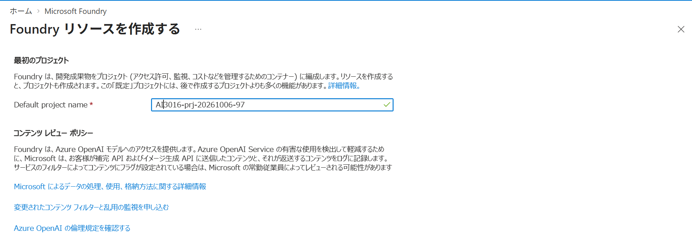
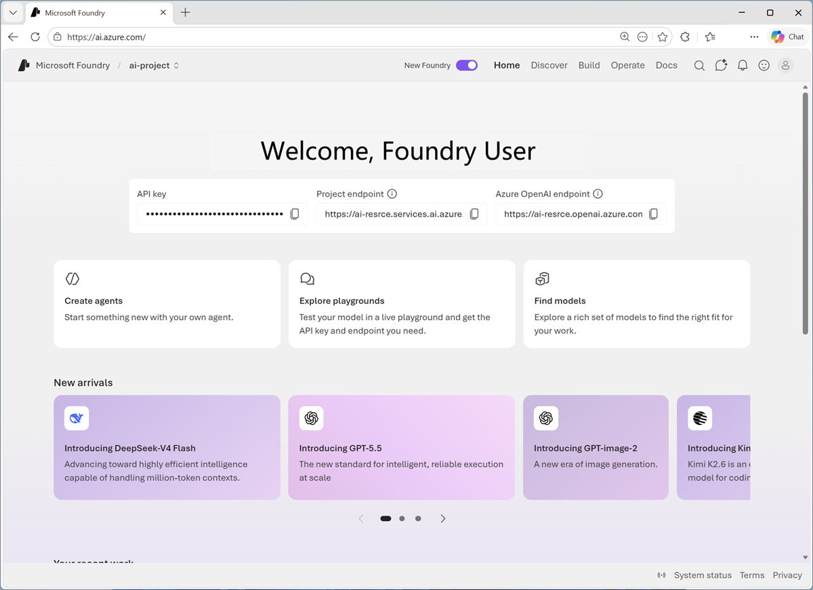
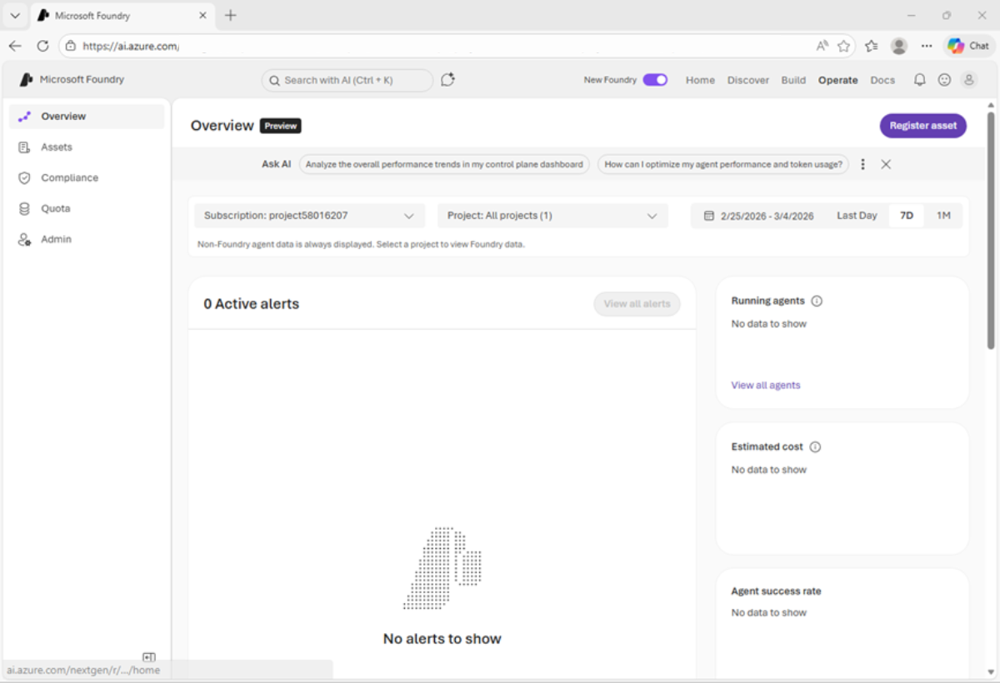

---
lab:
  title: AI 開発プロジェクトの準備
  description: Microsoft Foundry プロジェクトで AI リソースを整理し、Visual Studio Code 用の Foundry Toolkit 拡張機能の使用を開始する方法を学びます。
  level: 200
  duration: 30
  islab: true
  primarytopics:
    - Microsoft Foundry
    - Visual Studio Code
---

# AI 開発プロジェクトの準備

この演習では、Microsoft Foundry ポータルを使用してプロジェクトを作成し、AI ソリューションを構築するための準備を行います。

この演習は約 **30** 分かかります。

> **注**: この演習で使用されるテクノロジの一部は、プレビューの段階または開発中の段階です。 予期しない動作、警告、またはエラーが発生する場合があります。

## 今回のラボ環境をご自身のローカル環境で実現する場合

研修内で配布、使用する環境は以下が含まれています。ローカル環境でラボ内容を実行する場合はインストール等が必要となります。

- 有効な [Azure サブスクリプション](https://azure.microsoft.com/pricing/purchase-options/azure-account)
- [Visual Studio Code](https://code.visualstudio.com/) がインストールされていること
- [Python バージョン**3.13.xx**](https://www.python.org/downloads/release/python-31312/) がインストール済み
- [Git](https://git-scm.com/install/) がインストールおよび構成済み
- [Azure CLI](https://learn.microsoft.com/cli/azure/install-azure-cli?view=azure-cli-latest) がインストールされていること

## Microsoft Foundry プロジェクトを作成する

Microsoft Foundry では "プロジェクト" を使って、AI ソリューションの開発に使われるモデル、リソース、データ、その他の資産を整理します。ここでは Azure Portal から Foundry リソースと最初のプロジェクトを作成します。

1. Web ブラウザーで **InPrivateウィンドウ（シークレットウィンドウ）** を開き、[Azure Portal](https://portal.azure.com) (`https://portal.azure.com`) にアクセスします。配布された Azure 資格情報でサインインし、多要素認証 (MFA) を求められた場合は画面の指示に従って認証を完了します。

1. Azure Portal 上部の検索ボックスに `Microsoft Foundry` と入力して検索し、**[Microsoft Foundry]** を開きます。**[作成]** を選択して **[Foundry リソースを作成する]** 画面を開きます。

1. **[基本情報]** タブで、以下の内容を設定します。

    | 項目                 | 設定内容                                                                 |
    | -------------------- | ------------------------------------------------------------------------ |
    | サブスクリプション   | 従量課金（既定のまま）                                                   |
    | リソース グループ    | 割り当て済みの `AI3016Student<番号>` を選択（新規作成はしません）        |
    | 名前                 | `AI3016Foundry-<日付>-<番号>`（例: `AI3016Foundry-20261006-97`）         |
    | リージョン           | (US) East US                                                             |

    ![Foundry リソースを作成する画面の [基本情報] タブのスクリーンショット。](../media/foundry-resource-create-basics.png)

1. 同じ **[基本情報]** タブを下へスクロールし、**[最初のプロジェクト]** の **Default project name** に `AI3016-prj-<日付>-<番号>`（例: `AI3016-prj-20261006-97`）を入力します。

    

    > **注**: `<番号>` にはご自身の受講者番号（例: `AI3016Student97` の `97`）を使用します。

1. **[確認と作成]** を選択し、検証に成功したら **[作成]** を選択します。デプロイが完了したら **[リソースに移動]** を選択します。

1. リソースの画面から **[Foundry ポータルに移動]** を選択して Foundry ポータルを開きます。

    ポップアップが表示された場合は、"始めましょう" "スキップ" と順にクリックして閉じることでプロジェクトのホーム ページが開きます。
    
    


## モデルのデプロイとテスト

どの生成 AI プロジェクトの中核にも、少なくとも 1 つの生成 AI モデルがあります。

1. これで**ビルドを開始する**準備は完了です。画面上部の **[検出]** ボタンをクリックして、画面左側の **[モデル]** タブを選択してMicrosoft Foundry モデル カタログを表示します。

1. `gpt-4.1` モデルを検索し、検索結果から選択してそのモデル カードを表示します。

    モデル カードは、モデルの機能と制限事項を理解し、要件に適しているかどうかを判断するのに役立つモデルに関する情報を提供します。

1. 画面右上の **[デプロイ]** ボタンより **カスタム設定** を選択して、以下の内容でモデルをデプロイします。

    | 項目                            | 設定内容       |
    | ------------------------------- | -------------- |
    | デプロイ名                      | gpt-4.1        |
    | デプロイの種類                  | グローバル標準 |
    | 1分あたりのトークン数レート制限 | 50,000         |
    | ガードレール                    | DefaultV2      |

1. モデル デプロイにより、プロジェクト内のモデルを操作できます。

    モデルがデプロイされると、モデル プレイグラウンドが自動的に開き、モデルをテストできます。

1. **[手順（もしくは指示）]** ボックスに、次の指示を入力（書き換え）します。

    ```text
    あなたはAIソフトウェア開発に関する情報やアドバイスを提供できるAIアシスタントです。
    ```

1. チャット ウィンドウで「`AIアプリケーション開発において、大規模言語モデルを活用する際の3つの重要な考慮点を説明してください。`」などのクエリを入力し、応答を確認します。


## Foundry Azure のリソースとプロジェクト エンドポイントを表示する

1. Foundry ポータルの上部のメニュー バーで、**[操作（もしくは運用）]** を選択します。

    オペレーション センターでは、プロジェクトの監視、アラートの表示、エージェントのパフォーマンス監視、リソースの管理を行うことができます。

    

1. 上部のメニュー バーで、**[管理]** を選択します。

    - リソースの詳細は、プロジェクトをサポートするために Azure で作成された **[Foundry]** リソースに関連します。 このリソースは、Foundry のサービスとモデルへの接続を含んでおり、AI 開発プロジェクトへのユーザー アクセスを一元的に管理するための場所となります。
    - プロジェクトの詳細は個々のプロジェクトに関連します。プロジェクトでプロジェクト固有のリソースを追加および管理できます。 1 つのリソースで複数のプロジェクトをサポートできます (最初に作成されるのは、リソースの *default* プロジェクトです)。

1. プロジェクトに関連付けられている**親リソース**へのリンクを選択します。

    リソース構成の詳細が表示されるはずです。

    Foundry リソースには "エンドポイント" があり、ここを通じてクライアント アプリケーションが resource レベルの機能 (resource 内のすべてのプロジェクトで共有される Foundry Tools など) にアクセスできます。

1. メニュー バーで **[ホーム]** を選択して、プロジェクトのホーム ページに戻ります。
1. APIキー、プロジェクト エンドポイント、および Azure OpenAI エンドポイントは書き留めておいてください。

    この情報は、クライアント アプリケーションからプロジェクトレベルのリソースに接続するために使用されます。

    - "APIキー" は、モデルとツールに対するキーベースの認証に使用されます (ただし、ほとんどの運用環境のシナリオでは、認証済みのユーザーとアプリケーションの ID に基づく Microsoft Entra ID 認証の使用を検討する必要があります)。
    - "プロジェクト エンドポイント" は、**Responses** API を使用して Foundry で直接提供されるモデル (OpenAI モデルを含む) にアクセスしたり、Foundry 固有の API (Foundry Agent サービスなど) にアクセスしたりするために使用されます。
    - "OpenAI エンドポイント" は、**Chat Completions** API、**Responses** API など、OpenAI の API を使用してモデルにアクセスするために使用されます。

## Visual Studio Code 用の Foundry Toolkit 拡張機能をインストールする

開発者は、Foundry ポータルである程度の時間作業しますが、Visual Studio Code でも多くの時間を費やす可能性があります。 Foundry Toolkit 拡張機能は、開発環境を離れることなく Foundry プロジェクト リソースを操作するための便利な方法を提供します。

1. 演習用仮想マシンでVisual Studio Code を起動します。

1. 左側のナビゲーション バーで、**[拡張機能]** （ブロック状のアイコン）を表示します。

1. 拡張機能のマーケットプレースで `Foundry Toolkit` を検索し、**[Foundry Toolkit for VS Code]** 拡張機能をインストールします。

    拡張機能のインストールには 1 分ほどかかる場合があります。

1. 拡張機能をインストールした後、左側のナビゲーション バーで **[AI Toolkit]** （パズルピース状のアイコン）を選び、読み込まれるまで待ちます。

    [AI Toolkit] ペインの **[MODEL TOOLS]** セクションで、**[Model Playground]** を選択します。 次に、**[gpt-4.1]** モデルを選択します (まだ選択されていない場合)。

    モデルをテストできる対話型のプレイグラウンドが Visual Studio Code で開きます。
    
    > 注：実際のテストは本ラボフェーズでは実施しません。テストを実行しようとするとGitHubを介した認証が求められます。実際の運用ではこれらのツールを使用してモデルのテストとアプリの開発をVisual Studio Code上で効率良く進めることが可能です。


## まとめ

この演習では、Microsoft Foundry を作成し、Foundry ポータルで詳しく調べました。 また、Visual Studio Code の Foundry Toolkit 拡張機能についても調べました。これは、開発者が Foundry プロジェクトとそのアセットを操作するための便利な方法を提供します。
